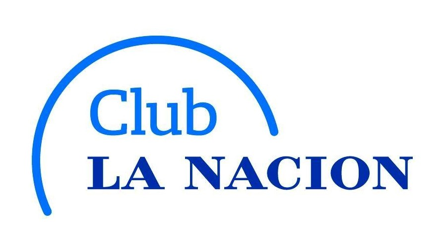

# Club La Nación

<p align="center"><a href="https://club-la-nacion-bertini.netlify.app/" target="_blank" ></a></p>

## Iniciar Proyecto

Primero, ejecute el servidor de desarrollo:

```bash
npm run dev
# o
yarn dev
```

Abrir [http://localhost:3000](http://localhost:3000) pra ver el resultado.

## Descripcion

Este proyecto fue solicitado por personal del sector desarrollo de "La Nacion" por medio de mi trabajo en ITR como desarrollador fullstack.
No se utilizó ninguna dependencia de tercero, como fue solicitado.

El proyecto esta desarrollado en NextJS y TypeScript

- [Next.js Documentation](https://nextjs.org/docs) - ver mas sobre Next.js sus caracteristicas y API.
- [Learn Next.js](https://nextjs.org/learn) - un tutorial interactivo de Next.js.

### Desarrollador

Nicolás Bertini Argañaras
[https://club-la-nacion-bertini.netlify.app/]
